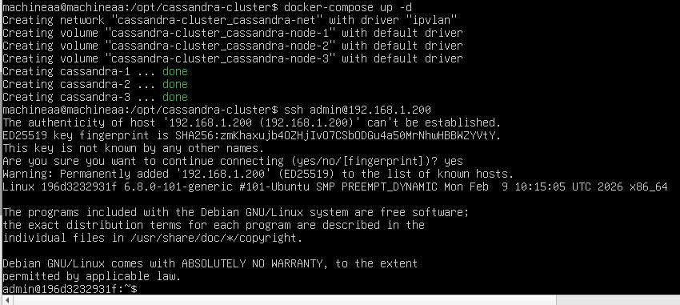
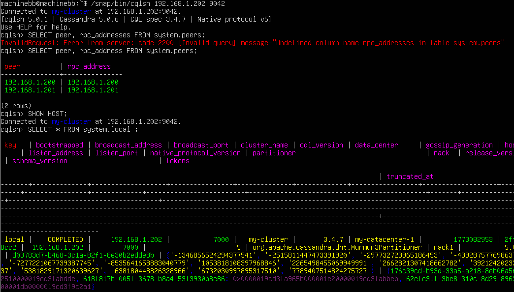

# Docker Compose скрипт для поднятия кластера из трех инстансов cassandra, доступных по отдельному ip адресу из основной сети, состоящей из двух ВМ(А и Б).

## Настройка виртуальных машинок(Oracle VM VirtualBox 7.0.16)
1. Создаем два виртуальных сервера(ubuntu 24.04 lts) по инструкции.
2. Создаем  в VirtualBox сеть NAT с IPv4 префиксом: 192.168.1.0/24.
3. Подключаем к этой сети наши машинки(Настройки -> Сеть -> Тип подключения: NAT -> Выбрать сеть)
4. Для машин активируем **Неразборчивый режим (Promiscuous Mode): "Разрешить всё"**

## Назначаем IP-адреса за виртуалками(192.168.1.197 и 192.168.1.198, соответственно)

1. Устанавливаем инструменты для работы с сетями.

   ```
   sudo apt install net-tools
   ```

2. Узнаем название сетевого интерфейса.

   ```
   ip route | grep default | awk '{print $5}'
   ```

3. Назначаем IP-адрес

   в файл /etc/netplan/50-cloud-init.yaml добавить и применить настройки. Переменные установить.

   ```
   network:
     ethernets:
       {$STEP_2}:
         dhcp4: false
         addresses: [{$IP-ADDRESS}/24]
         routes: 
         	- to: default
         	  via: 192.168.1.1
         nameservers:
           addresses: [8.8.8.8]
   ```
   
   ```
   sudo nano /etc/netplan/50-cloud-init.yaml
   sudo netplan apply
   ```


## Поднимаем кластер Cassandra(с лимитом кучи 1G на узел).
1. Устанавливаем docker и docker-compose.

2. Пользователя добавляем в группу докер 

   ``` sudo usermod -aG docker $USER 
   sudo usermod -aG docker $USER
   ```

3. Переходим в папку /opt и скачиваем репозиторий с гита.

4. Создаем виртуальный интерфейс, чтобы хост мог общаться с контейнерами. Делаем по науке.

   1. Создаем файл с настройками сетевого интерфейса 

      ```
      sudo nano /usr/local/bin/setup-ipvlan0.sh
      ```

      ```
      #!/bin/bash
      sudo ip link add ipvlan0 link {$STEP_2} type ipvlan mode l2
      sudo ip addr add 192.168.1.199/32 dev ipvlan0
      sudo ip link set ipvlan0 up
      sudo ip route add 192.168.1.200/29 dev ipvlan0
      ```

   2. Создаем файл для отключения.

      ```
      sudo nano /usr/local/bin/teardown-ipvlan0.sh
      ```

      ```
      #!/bin/bash
      ip link delete ipvlan0
      ```

   3. Делаем файлы исполняемыми

      ```
      sudo chmod +x /usr/local/bin/setup-ipvlan0.sh /usr/local/bin/teardown-ipvlan0.sh
      ```

   4. Создаем systemd-юнит

      ```
      sudo nano /etc/systemd/system/ipvlan0.service
      ```

      ```
      [Unit]
      Description=IPvlan0 interface setup
      After=network.target
      
      [Service]
      Type=oneshot
      RemainAfterExit=yes
      ExecStart=/usr/local/bin/setup-ipvlan0.sh
      ExecStop=/usr/local/bin/teardown-ipvlan0.sh
      
      [Install]
      WantedBy=multi-user.target
      ```

   5. Включаем сервис

      ```
      sudo systemctl enable ipvlan0.service
      sudo systemctl start ipvlan0.service
      ```


5. Создаем ключики

   ```
   ssh-keygen -t rsa -f ~/.ssh/id_rsa -N ""
   sudo cp ~/.ssh/id_rsa.pub /opt/authorized_keys
   ```

6. Поднимаем/отключаем кластер

   ```
   docker-compose up -d
   docker-compose down -v
   ```

7. Подключаемся по ssh

   ```
   ssh admin@192.168.1.200
   ```



## Настраиваем машину Б с cqlsh.

1. Устанавливаем cqlsh

   ```
   sudo snap install cqlsh
   snap help refresh
   ```

2. Подключаемся к нодам кластера

   ```
   /snap/bin/cqlsh 192.168.1.200 9042
   ```

3. Выполняем проверки

   ```
   SELECT peer, rpc_address FROM system.peers;
   SHOW HOST;
   SELECT * FROM system.local;
   ```




#### Дополнительный инструменты для настройки и отладки.

1. Пересобрать контейнер с ssh

   ```
   docker-compose build cassandra-1
   ```

   

2. Установка возможности перенаправления для сети

   ```
   sudo sysctl -w net.ipv4.ip_forward=1
   ```

3. Получение мак-адреса для хоста Б(при macvlan)

   ```
   ping -b 192.168.1.255
   arp -n | grep 192.168.1.200
   ```

4. Проверка текущих маршрутов на хосте А

   ```
   ip route show | grep 192.168.1.
   ```

5. Перехват трафика на машине А.

   ```
   sudo tcpdump -i enp0s3 host 192.168.1.198
   ```

6. Добавление явного маршрута через интерфейс с указанием источника

   ```
   sudo ip route add 192.168.1.200/29 dev enp0s3 src 192.168.1.197
   ```

7. Включение proxy ARP (если ничего не помогает)

   ```
   sudo sysctl -w net.ipv4.conf.enp0s3.proxy_arp=1
   ```

8. Проверка iptables на хосте и смена политики **FORWARD** 

   ```
   sudo iptables -L -n -v
   sudo iptables -t filter -L FORWARD -n -v
   sudo iptables -P FORWARD ACCEPT
   ```


Артефакт. Попытка через macvlan

```
ip link add macvlan0 link enp0s3 type macvlan mode bridge
ip addr add 192.168.1.199/32 dev macvlan0
ip link set macvlan0 up
ip route add 192.168.1.200/29 dev macvlan0
```

